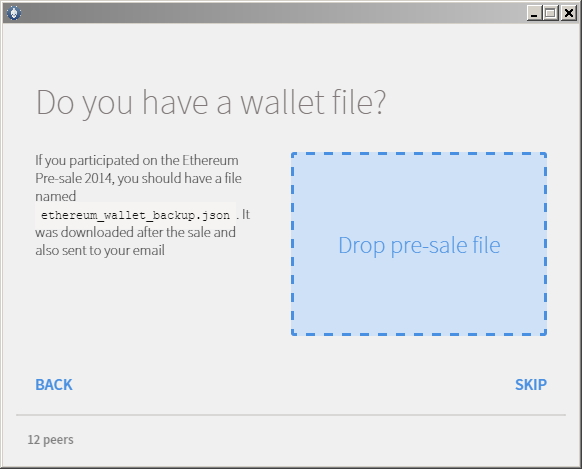

********************************************************************************
Account Management
********************************************************************************

.. _Accounts:

Accounts
================================================================================

Accounts play a central role in Ethereum. There are two types of accounts: *externally owned accounts* (EOAs) and *contract accounts*. Here we focus on externally owned accounts, which will be referred to simply as *accounts*. Contract accounts will be referred to as *contracts* and are :ref:`discussed in detail in Contracts <Contracts>`. This generic notion of account subsuming both externally owned accounts and contracts is justified in that these entities are so called *state objects*. These entities have a state: accounts have balance and contracts have both balance and contract storage. The state of all accounts is the state of the Ethereum network which is updated with every block and which the network really needs to reach a consensus about.
Account are essential for users to interact with the Ethereum blockchain via transactions.

If we restrict Ethereum to only externally owned accounts and allow only transactions between them, we arrive at an "altcoin" system that is less powerful than bitcoin itself and can only be used to transfer ether.

Accounts represent identities of external agents (e.g., human personas, mining nodes or automated agents). Accounts use public key cryptography to sign transaction so that the EVM can securely validate the identity of a transaction sender.

Keyfiles
================================================================================

Every account is defined by a pair of keys, a private key and public key. Accounts are indexed by their *address* which is derived from the public key by taking the last 20 bytes. Every private key/address pair is encoded in a *keyfile*. Keyfiles are JSON text files which you can open and view in any text editor. The critical component of the keyfile, your account’s private key, is always encrypted, and it is encrypted with the password you enter when you create the account. Keyfiles are found in the ``keystore`` subdirectory of your Ethereum node’s data directory. Make sure you backup your keyfiles regularly! See the section :ref:`backup-and-restore-accounts` for more information.

Creating a key is tantamount to creating an account.

* You don't need to tell anybody else you're doing it
* You don't need to synchronize with the blockchain
* You don't need to run a client
* You don't even need to be connected to the internet

Of course your new account will not contain any Ether. But it'll be yours and you can be certain that without your key and your password, nobody else can ever access it.

It is safe to transfer the entire directory or any individual keyfile between Ethereum nodes.

.. Warning:: Note that in case you are adding keyfiles to your node from a different node, the order of accounts may change. So make sure you do not rely or change the index in your scripts or code snippets.

.. _creating_an_account:

Creating an account
================================================================================

.. Warning:: **Remember your passwords and `backup your keyfiles <backup-and-restore-accounts>`_.** In order to send transactions from an account, including sending ether, you must have BOTH the keyfile and the password. Be absolutely sure to have a copy of your keyfile AND remember the password for that keyfile, and store them both as securely as possible. There are no escape routes here; lose the keyfile or forget your password and all your ether is gone. It is NOT possible to access your account without a password and there is no *forgot my password* option here. Do not forget it.

Using ``geth account new``
--------------------------------------------------------------------------------

Once you have the geth client installed, creating an account is merely a case of executing the ``geth account new`` command in a terminal.

Note that you do not have to run the geth client or sync up with the blockchain to use the ``geth account`` command.

.. code-block:: Bash

  $ geth account new

    Your new account is locked with a password. Please give a password. Do not forget this password.
    Passphrase:
    Repeat Passphrase:
    Address: {168bc315a2ee09042d83d7c5811b533620531f67}

For non-interactive use you supply a plaintext password file as argument to the ``--password`` flag. The data in the file consists of the raw bytes of the password optionally followed by a single newline.

.. code-block:: Bash

  $ geth --password /path/to/password account new

..  Warning:: Using the ``--password`` flag is meant to be used only for testing or automation in trusted environments. It is a bad idea to save your password to file or expose it in any other way. If you do use the ``--password`` flag with a password file, make sure the file is not readable or even listable for anyone but you. You can achieve this in Mac/Linux systems with:

.. code-block:: Bash

  touch /path/to/password
  chmod 600 /path/to/password
  cat > /path/to/password
  >I type my pass

To list all the accounts with keyfiles currently in you’re ``keystore`` folder use the ``list`` subcommand of the ``geth account`` command:

.. code-block:: Bash

  $ geth account list

  account #0: {a94f5374fce5edbc8e2a8697c15331677e6ebf0b}
  account #1: {c385233b188811c9f355d4caec14df86d6248235}
  account #2: {7f444580bfef4b9bc7e14eb7fb2a029336b07c9d}

The filenames of keyfiles has the format ``UTC--<created_at UTC ISO8601>-<address hex>``. The order of accounts when listing, is lexicographic, but as a consequence of the timestamp format, it is actually order of creation.

Using geth console
--------------------------------------------------------------------------------

In order to create a new account using geth, we must first start geth in console mode (or you can use ``geth attach`` to attach a console to an already running instance):

.. code-block:: Bash

  > geth console 2>> file_to_log_output
  instance: Geth/v1.4.0-unstable/linux/go1.5.1
  coinbase: coinbase: [object Object]
  at block: 865174 (Mon, 18 Jan 2016 02:58:53 GMT)
  datadir: /home/USERNAME/.ethereum

The console allows you to interact with your local node by issuing commands. For example, try the command to list your accounts:

.. code-block:: Javascript

  > eth.accounts

  {
  code: -32000,
  message: "no keys in store"
  }

This shows that you have no accounts. You can also create an account from the console:

.. code-block:: Javascript

  > personal.newAccount()
  Passphrase:
  Repeat passphrase:
  "0xb2f69ddf70297958e582a0cc98bce43294f1007d"

.. Note:: Remember to use a strong and randomly generated password.

We just created our first account. If we try to list our accounts again we can see our new account:

.. code-block:: Javascript

  > eth.accounts
  ["0xb2f69ddf70297958e582a0cc98bce43294f1007d"]

.. _using-mist-ethereum-wallet:

Using Mist Ethereum wallet
--------------------------------------------------------------------------------

For the command line averse, there is now a GUI-based option for creating accounts: The “official” Mist Ethereum wallet. The Mist Ethereum wallet, and its parent Mist project, are being developed under the auspices of the Ethereum Foundation, hence the “official” status. Versions of the wallet app are available for Linux, Mac OS X, and Windows.

.. Warning:: The Mist wallet is beta software. Please beware and use it at your own risk.

Creating an account using the GUI Mist Ethereum wallet couldn’t be easier. In fact, your first account is created during the installation of the app.

1. `Download the latest version of the wallet app <https://github.com/ethereum/mist/releases>`_  for your operating system. Opening the Wallet App will kick off syncing a full copy of the Ethereum blockchain on your computer, since you will in effect be running a full geth node.

2. Unzip the downloaded folder and run the Ethereum-Wallet executable file.

.. image:: img/51Downloading.png
   :width: 582px
   :height: 469px
   :scale: 75 %
   :alt: downloading-mist
   :align: center

3. Wait for the blockchain to fully sync, then follow the instructions on the screen and your first account will be created.

4. When you launch the Mist Ethereum wallet for the first time, you will see the account you created during the installation process. By default it will be named MAIN ACCOUNT (ETHERBASE).

.. image:: img/51OpeningScreen.png
   :width: 1024px
   :height: 938px
   :scale: 50 %
   :alt: opening-screen
   :align: center

5. Creating additional accounts is easy; just click on ADD ACCOUNT in the app’s main screen and enter the required password.

.. Note:: The Mist wallet is still in active development, so details of the steps outlined above may change with upgrades.

Creating a Multi-Signature Wallet in Mist
--------------------------------------------------------------------------------

The Mist Ethereum wallet has an option to secure your wallet balance with a multisig wallet. The advantage of using a multisig wallet is that it requires authorization from more than one account to withdrawal larger amounts from your balance. Before you can create a multisig wallet, you'll need to create more than one account.

It's very easy to create account files in Mist. In the 'Accounts' section click 'Add Account'. Pick a strong yet easy-to-remember password (remember there is no password recovery option), confirm it, and your account is created. Create at least 2 accounts. Secondary accounts can be created on separate computers running Mist if you prefer (and theoretically make your multisig more secure doing it this way). You only need the public keys (your deposit addresses) of your secondary accounts when creating the multisig wallet (copy/paste them, do not ever type them by hand). Your primary account will be needed to create the multisig wallet contract, so it must be on the computer you are creating the multisig wallet on.

Now that you have your accounts setup, be safe and back them up (if your computer crashes, you will lose your balance if you do not have a backup). Click 'Backup' in the top menu. Choose the 'keystore' folder, opposite-click on it / choose 'copy' (do NOT choose 'cut', that would be very bad). Navigate to your desktop, opposite-click in a blank area and choose 'paste'. You may want to rename this new copy of the 'keystore' folder to something like 'Ethereum-keystore-backup-year-month-day' so you have quick recognition of it later. At this point you can then add the folder contents to a zip / rar file (and even password-protect the archive with another strong yet easy-to-remember password if backing up online), copy it to a USB Drive, burn it to a CD / DVD, or upload it to online storage (Dropbox / Google Drive / etc).

You now should add approximately no less than 0.02 ETH to your primary account (the account you will initiate creation of a multisig wallet with). This is required for the transaction fee when you create the multisig wallet contract. An additional 1 ETH (or more) is also needed, because Mist currently requires this to assure wallet contract transactions have enough 'gas' to execute properly...so no less than about 1.02 ETH total for starters.

You will be entering the full addresses of all the accounts you are attaching to this multisig wallet, when you create it. I recommend copying / pasting each address into a plain text editor (notepad / kedit / etc), after going to each account's details page in Mist, and choosing 'copy address' from the right-side column of buttons. Never type an address by hand, or you run a very high risk of typos and could lose your balance sending transactions to the wrong address.

We are now ready to create the multisig wallet. Under 'Wallet Contracts', select 'Add Wallet Contract'. Give it a name, select the primary account owner, and choose 'Multisignature Wallet Contract'. You will see something like this appear:

"This is a joint account controlled by X owners. You can send up to X ether per day. Any transaction over that daily limit requires the confirmation of X owners."

Set whatever amount of owners (accounts) you are attaching to this multisig wallet, whatever you want for a daily withdrawal limit (that only requires one account to withdrawal that amount), and how many owners (accounts) are required to approve any withdrawal amount over the daily limit.

Now add the addresses of the accounts that you copied / pasted into your text editor earlier, confirm all your settings are correct, and click 'Create' at the bottom. You will then need to enter your password to send the transaction. In the 'Wallet Contracts' section it should show your new wallet, and say 'creating'.

When wallet creation is complete, you should see your contract address on the screen. Select the entire address, copy / paste it into a new text file in your text editor, and save the text file to your desktop as 'Ethereum-Wallet-Address.txt', or whatever you want to name it.

Now all you need to do is backup the 'Ethereum-Wallet-Address.txt' file the same way you backed up your account files, and then you are ready to load your new multisig wallet with ETH using this address.

If you are restoring from backup, simply copy the files inside the 'Ethereum-keystore-backup' folder over into the 'keystore' folder mentioned in the first section of this walkthrough. FYI, you may need to create the 'keystore' folder if it's a brand new install of Mist on a machine it was never installed on before (the first time you create an account is when this folder is created). As for restoring a multisig wallet, instead of choosing 'Multisignature Wallet Contract' like we did before when creating it, we merely choose 'Import Wallet' instead.

Troubleshooting:

* Mist won't sync. One solution that works well is syncing your PC hardware clock with an NTP server so the time is exactly correct...then reboot.

* Mist starts after syncing, but is a blank white screen. Chances are you are running the "xorg" video drivers on a Linux-based OS (Ubuntu, Linux Mint, etc). Try installing the manufacturer's video driver instead.

* "Wrong password" notice. This seems to be a false notice on occasion on current Mist versions. Restart Mist and the problem should go away (if you indeed entered the correct password).

Using Eth
--------------------------------------------------------------------------------

Every options related to key management available using geth can be used the same way in eth.

Below are "account" related options:

.. code-block:: Javascript

  > eth account list  // List all keys available in wallet.
  > eth account new   // Create a new key and add it to the wallet.
  > eth account update [<uuid>|<address> , ... ]  // Decrypt and re-encrypt given keys.
  > eth account import [<uuid>|<file>|<secret-hex>] // Import keys from given source and place in wallet.

Below are "wallet" related option:

.. code-block:: Javascript

  > eth wallet import <file> //Import a presale wallet.

.. Note:: the 'account import' option can only be used to import generic key file. the 'wallet import' option can only be used to import a presale wallet.

It is also possible to access keys management from the integrated console (using the built-in console or geth attach):

.. code-block:: Javascript

  > web3.personal
  {
	listAccounts: [],
	getListAccounts: function(callback),
	lockAccount: function(),
	newAccount: function(),
	unlockAccount: function()
  }

Using EthKey (deprecated)
--------------------------------------------------------------------------------

Ethkey is a CLI tool of the C++ implementation that allows you to interact with the Ethereum wallet. With it you can list, inspect, create, delete and modify keys and inspect, create and sign transactions.

We will assume you have not yet run a client such as eth or anything in the Aleth series of clients. If you have, you can skip this section.
To create a wallet, run ``ethkey`` with the ``createwallet`` command:

.. code-block:: Bash

  > ethkey createwallet

Please enter a MASTER passphrase to protect your key store (make it strong!):
You'll be asked for a "master" passphrase. This protects your privacy and acts as a default password for any keys. You'll need to confirm it by entering the same text again.

.. Note:: Use a strong randomly generated password.

We can list the keys within the wallet simply by using the list command:

.. code-block:: Bash

  > ethkey list

  No keys found.

We haven't yet created any keys, and it's telling us so! Let's create one.

To create a key, we use the ``new`` command. To use it we must pass a name - this is the name we'll give to this account in the wallet. Let's call it "test":

.. code-block:: Bash

  > ethkey new test

Enter a passphrase with which to secure this account (or nothing to use the master passphrase).
It will prompt you to enter a passphrase to protect this key. If you just press enter, it'll use the default "master" passphrase. Typically this means you won't need to enter the passphrase for the key when you want to use the account (since it remembers the master passphrase). In general, you should try to use a different passphrase for each key since it prevents one compromised passphrase from giving access to other accounts. However, out of convenience you might decide that for low-security accounts to use the same passphrase.

Here, let's give it the incredibly imaginative passphrase of 123. (Never ever use simple passwords like this for anything else than ephemeral test accounts).
Once you enter a passphrase, it'll ask you to confirm it by entering again. Enter 123 a second time.
Because you gave it its own passphrase, it'll also ask you to provide a hint for this password which will be displayed to you whenever it asks you to enter it. The hint is stored in the wallet and is itself protected by the master passphrase. Enter the truly awful hint of 321 backwards.

.. code-block:: Bash

  > ethkey new test

  Enter a passphrase with which to secure this account (or nothing to use the master passphrase):
  Please confirm the passphrase by entering it again:
  Enter a hint to help you remember this passphrase: 321 backwards
  Created key 055dde03-47ff-dded-8950-0fe39b1fa101
    Name: test
    Password hint: 321 backwards
    ICAP: XE472EVKU3CGMJF2YQ0J9RO1Y90BC0LDFZ
    Raw hex: 0092e965928626f8880629cec353d3fd7ca5974f

All normal (aka direct) ICAP addresses begin with XE so you should be able to recognize them easily. Notice also that the key has another identifier after Created key. This is known as the UUID. This is a unique identifier for the key that has absolutely nothing to do with the account itself. Knowing it does nothing to help an attacker discover who you are on the network. It also happens to be the filename for the key, which you can find in either ~/.web3/keys (Mac or Linux) or $HOME/AppData/Web3/keys (Windows).
Now let's make sure it worked properly by listing the keys in the wallet:

.. code-block:: Bash

  > ethkey list
  055dde03-47ff-dded-8950-0fe39b1fa101 0092e965… XE472EVKU3CGMJF2YQ0J9RO1Y90BC0LDFZ  test

It reports one key on each line (for a total of one key here). In this case our key is stored in a file 055dde... and has an ICAP address beginning XE472EVK.... Not especially easy things to remember so rather helpful that it has its proper name, test, too.

Importing your presale wallet
================================================================================

Using Mist Ethereum wallet
--------------------------------------------------------------------------------

Importing your presale wallet using the GUI Mist Ethereum wallet is very easy. In fact, you will be asked if you want to import your presale wallet during the installation of the app.

.. Warning:: Mist wallet is beta software. Beware and use it at your own risk.

Instructions for installing the Mist Ethereum wallet are given in the section :ref:`Creating an account: Using Mist Ethereum wallet <using-mist-ethereum-wallet>`.

Simply drag-and-drop your ``.json`` presale wallet file into the designated area and enter your password to import your presale account.

If you choose not to import your presale wallet during installation of the app, you can import it at any time by selecting the ``Accounts`` menu in the app’s menu bar and then selecting ``Import Pre-sale Accounts``.

.. Note:: The Mist wallet is still in active development, so details of the steps outlined above may change with upgrades.

Using geth
--------------------------------------------------------------------------------

If you have a standalone installation of geth, importing your presale wallet is accomplished by executing the following command in a terminal:

.. code-block:: Bash

  geth wallet import /path/to/my/presale-wallet.json

You will be prompted to enter your password.

Updating an account
================================================================================

You are able to upgrade your keyfile to the latest keyfile format and/or upgrade your keyfile password.

Using geth
--------------------------------------------------------------------------------

You can update an existing account on the command line with the ``update`` subcommand with the account address or index as parameter. Remember that the account index reflects the order of creation (lexicographic order of keyfile names containing the creation time).

.. code-block:: Bash

  geth account update b0047c606f3af7392e073ed13253f8f4710b08b6

or

.. code-block:: Bash

  geth account update 2

For example:

.. code-block:: Bash

  $ geth account update a94f5374fce5edbc8e2a8697c15331677e6ebf0b

  Unlocking account a94f5374fce5edbc8e2a8697c15331677e6ebf0b | Attempt 1/3
  Passphrase:
  0xa94f5374fce5edbc8e2a8697c15331677e6ebf0b
  account 'a94f5374fce5edbc8e2a8697c15331677e6ebf0b' unlocked.
  Please give a new password. Do not forget this password.
  Passphrase:
  Repeat Passphrase:
  0xa94f5374fce5edbc8e2a8697c15331677e6ebf0b

The account is saved in the newest version in encrypted format, you are prompted for a passphrase to unlock the account and another to save the updated file. This same command can be used to migrate an account of a deprecated format to the newest format or change the password for an account.

For non-interactive use the passphrase can be specified with the ``--password`` flag:

.. code-block:: Bash

  geth --password <passwordfile> account update a94f5374fce5edbc8e2a8697c15331677e6ebf0bs

Since only one password can be given, only format update can be performed, changing your password is only possible interactively.

.. Note:: account update has the side effect that the order of your accounts may change. After a successful update, all previous formats/versions of that same key will be removed!

.. _backup-and-restore-accounts:

Backup and restore accounts
================================================================================

Manual backup/restore
--------------------------------------------------------------------------------

You must have an account’s keyfile to be able to send any transaction from that account. Keyfiles are found in the keystore subdirectory of your Ethereum node’s data directory. The default data directory locations are platform specific:

- Windows: ``C:\Users\username\%appdata%\Roaming\Ethereum\keystore``
- Linux: ``~/.ethereum/keystore``
- Mac: ``~/Library/Ethereum/keystore``

To backup your keyfiles (accounts), copy either the individual keyfiles within the ``keystore`` subdirectory or copy the entire ``keystore`` folder.

To restore your keyfiles (accounts), copy the keyfiles back into the ``keystore`` subdirectory, where they were originally.

Importing an unencrypted private key
--------------------------------------------------------------------------------

Importing an unencrypted private key is supported by ``geth``

.. code-block:: Bash

  geth account import /path/to/<keyfile>

This command imports an unencrypted private key from the plain text file ``<keyfile>`` and creates a new account and prints the address.
The keyfile is assumed to contain an unencrypted private key as canonical EC raw bytes encoded into hex.
The account is saved in encrypted format, you are prompted for a passphrase. You must remember this passphrase to unlock your account in the future.

An example where the data directory is specified. If the ``--datadir`` flag is not used, the new account will be created in the default data directory, i.e., the keyfile will be places in the ``keyfiles`` subdirectory of the data directory.

.. code-block:: Bash

  $ geth --datadir /someOtherEthDataDir  account import ./key.prv
  The new account will be encrypted with a passphrase.
  Please enter a passphrase now.
  Passphrase:
  Repeat Passphrase:
  Address: {7f444580bfef4b9bc7e14eb7fb2a029336b07c9d}

For non-interactive use the passphrase can be specified with the ``--password`` flag:

.. code-block:: Bash

  geth --password <passwordfile> account import <keyfile>

.. Note:: Since you can directly copy your encrypted accounts to another Ethereum instance, this import/export mechanism is not needed when you transfer an account between nodes.

.. Warning:: When you copy keys into an existing node's ``keystore``, the order of accounts you are used to may change. Therefore you make sure you either do not rely on the account order or double-check and update the indexes used in your scripts.
