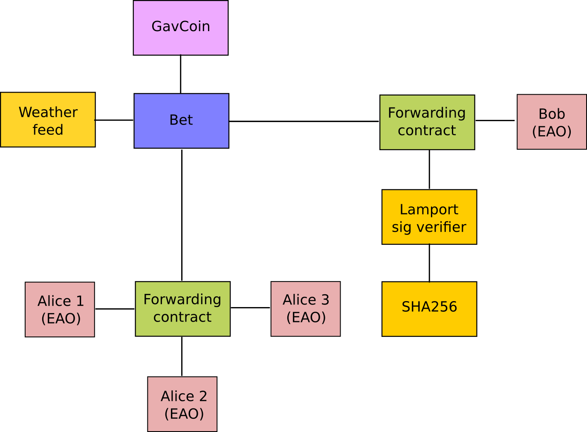
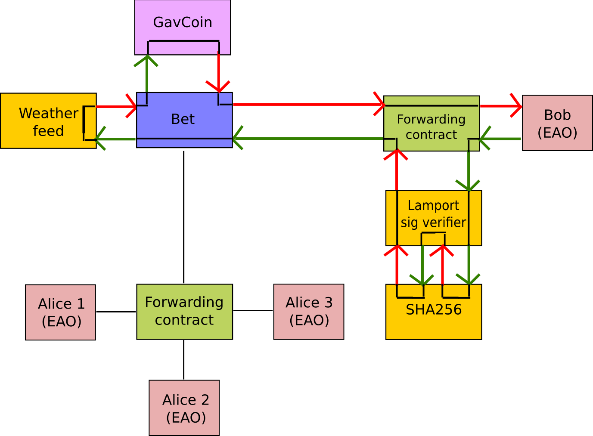

.. _account-types-gas-and-transactions:

********************************************************************************
Account Types, Gas, and Transactions
********************************************************************************

EOA vs contract accounts
================================================================================

There are two types of accounts in Ethereum
  - Externally Owned Accounts
  - Contracts Accounts

This distinction might be eliminated in Serenity.

Externally owned accounts (EOAs)
--------------------------------------------------------------------------------

An externally controlled account

- has an Ether balance,
- can send transactions (ether transfer or trigger contract code),
- is controlled by private keys,
- has no associated code.

Contract accounts
--------------------------------------------------------------------------------

A contract

- has an Ether balance,
- has associated code,
- code execution is triggered by transactions or messages (calls) received from other contracts.
- when executed
  - perform operations of arbitrary complexity (Turing completeness)
  - manipulate its own persistent storage, i.e.,  can have its own permanent state
  - can call other contracts

All action on the Ethereum block chain is set in motion by transactions fired from externally owned accounts. Every time a contract account receives a transaction, its code is executed as instructed by the input parameters sent as part of the transaction. The contract code is executed by the Ethereum Virtual Machine on each node participating in the network as part of their verification of new blocks.

This execution needs to be completely deterministic, its only context is the position of the block on the blockchain and all data available.
The blocks on the blockchain represent units of time, the blockchain itself is a temporal dimension and represents the entire history of states at the discrete time points designated by the blocks on the chain.

All Ether balances and values are denominated in units of wei: 1 Ether is 1e18 wei.

.. note:: "Contracts" in Ethereum should not be seen as something that should be "fulfilled" or "complied with"; rather, they are more like "autonomous agents" that live inside of the Ethereum execution environment, always executing a specific piece of code when "poked" by a message or transaction, and having direct control over their own ether balance and their own key/value store to store their permanent state.

What is a transaction?
================================================================================

The term "transaction" is used in Ethereum to refer to the signed data package that stores a message to be sent from an externally owned account to another account on the blockchain.

Transactions contain:
 - the recipient of the message,
 - a signature identifying the sender and proving their intention to send the message via the blockchain to the recipient,
 - ``VALUE`` field - The amount of wei to transfer from the sender to the recipient,
 - an optional data field, which can contain the message sent to a contract,
 - a ``STARTGAS`` value, representing the maximum number of computational steps the transaction execution is allowed to take,
 - a ``GASPRICE`` value, representing the fee the sender is willing to pay for gas. One unit of gas corresponds to the execution of one atomic instrucion, i.e., a computational step.

What is a message?
================================================================================

Contracts have the ability to send "messages" to other contracts. Messages are virtual objects that are never serialized and exist only in the Ethereum execution environment.
They can be conceived of as function calls.

A message contains:
 - the sender of the message (implicit).
 - the recipient of the message
 - ``VALUE`` field - The amount of wei to transfer alongside the message to the contract address,
 - an optional data field, that is the actual input data to the contract
 - a ``STARTGAS`` value, which limits the maximum amount of gas the code execution triggered by the message can incur.

Essentially, a message is like a transaction, except it is produced by a contract and not an external actor. A message is produced when a contract currently executing code executes the ``CALL`` or ``DELEGATECALL`` opcodes, which produces and executes a message. Like a transaction, a message leads to the recipient account running its code. Thus, contracts can have relationships with other contracts in exactly the same way that external actors can.

What is gas?
================================================================================

Ethereum implements an execution environment on the blockchain called the Ethereum Virtual Machine (EVM). Every node participating in the network runs the EVM as part of the block verification protocol. They go through the transactions listed in the block they are verifying and run the code as triggered by the transaction within the EVM. Each and every full node in the network does the same calculations and stores the same values. Clearly Ethereum is not about optimising efficiency of computation. Its parallel processing is redundantly parallel. This is to offer an efficient way to reach consensus on the system state without needing trusted third parties, oracles or violence monopolies. But importantly they are not there for optimal computation. The fact that contract executions are redundantly replicated across nodes, naturally makes them expensive, which generally creates an incentive not to use the blockchain for computation that can be done offchain.

When you are running a decentralized application (dapp), it interacts with the blockchain to read and modify its state, but dapps will typically only put the business logic and state that are crucial for consensus on the blockchain.

When a contract is executed as a result of being triggered by a message or transaction, every instruction is executed on every node of the network. This has a cost: for every executed operation there is a specified cost, expressed in a number of gas units.

Gas is the name for the execution fee that senders of transactions need to pay for every operation made on an Ethereum blockchain. The name gas is inspired by the view that this fee acts as cryptofuel, driving the motion of smart contracts. Gas is purchased for ether from the miners that execute the code. Gas and ether are decoupled deliberately since units of gas align with computation units having a natural cost, while the price of ether generally fluctuates as a result of market forces. The two are mediated by a free market: the price of gas is actually decided by the miners, who can refuse to process a transaction with a lower gas price than their minimum limit. To get gas you simply need to add ether to your account. The Ethereum clients automatically purchase gas for your Ether in the amount you specify as your maximum expenditure for the transaction.

The Ethereum protocol charges a fee per computational step that is executed in a contract or transaction to prevent deliberate attacks and abuse on the Ethereum network. Every transaction is required to include a gas limit and a fee that it is willing to pay per gas. Miners have the choice of including the transaction and collecting the fee or not. If the total amount of gas used by the computational steps spawned by the transaction, including the original message and any sub-messages that may be triggered, is less than or equal to the gas limit, then the transaction is processed. If the total gas exceeds the gas limit, then all changes are reverted, except that the transaction is still valid and the fee can still be collected by the miner. All excess gas not used by the transaction execution is reimbursed to the sender as Ether. You do not need to worry about overspending, since you are only charged for the gas you consume. This means that it is useful as well as safe to send transactions with a gas limit well above the estimates.

Estimating transaction costs
================================================================================

The total ether cost of a transaction is based on 2 factors:

``gasUsed`` is the total gas that is consumed by the transaction

``gasPrice`` price (in ether) of one unit of gas specified in the transaction

**Total cost = gasUsed * gasPrice**

gasUsed
--------------------------------------------------------------------------------

Each operation in the EVM was assigned a number of how much gas it consumes. ``gasUsed`` is the sum of all the gas for all the operations executed. There is a `spreadsheet <http://ethereum.stackexchange.com/q/52/42>`_ which offers a glimpse to some of the analysis behind this.

For estimating ``gasUsed``, there is an `estimateGas API <http://ethereum.stackexchange.com/q/266/42>`_ that can be used but has some caveats.

gasPrice
--------------------------------------------------------------------------------

A user constructs and signs a transaction, and each user may specify whatever ``gasPrice`` they desire, which can be zero. However, the Ethereum clients launched at Frontier had a default gasPrice of 0.05e12 wei. As miners optimize for their revenue, if most transactions are being submitted with a gasPrice of 0.05e12 wei, it would be difficult to convince a miner to accept a transaction that specified a lower, or zero, gasPrice.

Example transaction cost
--------------------------------------------------------------------------------

Let’s take a contract that just adds 2 numbers. The EVM OPCODE ``ADD`` consumes 3 gas.

The approximate cost, using the default gas price (as of January 2016), would be:

3 \* 0.05e12 = 1.5e11 wei

Since 1 Ether is 1e18 wei, the total cost would be 0.00000015 Ether.

This is a simplification since it ignores some costs, such as the cost of passing the 2 numbers to contract, before they can even be added.

* `question <http://ethereum.stackexchange.com/q/324/42>`_
* `gas fees <http://ether.fund/tool/gas-fees>`_
* `gas cost calculator <http://ether.fund/tool/calculator>`_
* `Ethereum Gas Prices <https://docs.google.com/spreadsheets/d/1m89CVujrQe5LAFJ8-YAUCcNK950dUzMQPMJBxRtGCqs>`_

=================  =========    =============================
Operation Name     Gas Cost     Remark
=================  =========    =============================
step               1            default amount per execution cycle
stop               0            free
suicide            0            free
sha3               20
sload              20           get from permanent storage
sstore             100          put into permanent storage
balance            20
create             100          contract creation
call               20           initiating a read-only call
memory             1            every additional word when expanding memory
txdata             5            every byte of data or code for a transaction
transaction        500          base fee transaction
contract creation  53000        changed in homestead from 21000
=================  =========    =============================

Account interactions example - betting contract
================================================================================

As previously mentioned, there are two types of accounts:

* **Externally owned account (EOAs)**: an account controlled by a private key, and if you own the private key associated with the EOA you have the ability to send ether and messages from it.
* **Contract**: an account that has its own code, and is controlled by code.

By default, the Ethereum execution environment is lifeless; nothing happens and the state of every account remains the same. However, any user can trigger an action by sending a transaction from an externally owned account, setting Ethereum's wheels in motion. If the destination of the transaction is another EOA, then the transaction may transfer some ether but otherwise does nothing. However, if the destination is a contract, then the contract in turn activates, and automatically runs its code.

The code has the ability to read/write to its own internal storage (a database mapping 32-byte keys to 32-byte values), read the storage of the received message, and send messages to other contracts, triggering their execution in turn. Once execution stops, and all sub-executions triggered by a message sent by a contract stop (this all happens in a deterministic and synchronous order, ie. a sub-call completes fully before the parent call goes any further), the execution environment halts once again, until woken by the next transaction.

Contracts generally serve four purposes:

* Maintain a data store representing something which is useful to either other contracts or to the outside world; one example of this is a contract that simulates a currency, and another is a contract that records membership in a particular organization.
* Serve as a sort of externally-owned account with a more complicated access policy; this is called a "forwarding contract" and typically involves simply resending incoming messages to some desired destination only if certain conditions are met; for example, one can have a forwarding contract that waits until two out of a given three private keys have confirmed a particular message before resending it (ie. multisig). More complex forwarding contracts have different conditions based on the nature of the message sent. The simplest use case for this functionality is a withdrawal limit that is overrideable via some more complicated access procedure. A wallet contract is a good example of this.
* Manage an ongoing contract or relationship between multiple users. Examples of this include a financial contract, an escrow with some particular set of mediators, or some kind of insurance. One can also have an open contract that one party leaves open for any other party to engage with at any time; one example of this is a contract that automatically pays a bounty to whoever submits a valid solution to some mathematical problem, or proves that it is providing some computational resource.
* Provide functions to other contracts, essentially serving as a software library.

Contracts interact with each other through an activity that is alternately called either "calling" or "sending messages". A "message" is an object containing some quantity of ether, a byte-array of data of any size, the addresses of a sender and a recipient. When a contract receives a message, it has the option of returning some data, which the original sender of the message can then immediately use. In this way, sending a message is exactly like calling a function.

Because contracts can play such different roles, we expect that contracts will be interacting with each other. As an example, consider a situation where Alice and Bob are betting 100 GavCoin that the temperature in San Francisco will not exceed 35ºC at any point in the next year. However, Alice is very security-conscious, and as her primary account uses a forwarding contract which only sends messages with the approval of two out of three private keys. Bob is paranoid about quantum cryptography, so he uses a forwarding contract which passes along only messages that have been signed with Lamport signatures alongside traditional ECDSA (but because he's old fashioned, he prefers to use a version of Lamport sigs based on SHA256, which is not supported in Ethereum directly).

The betting contract itself needs to fetch data about the San Francisco weather from some contract, and it also needs to talk to the GavCoin contract when it wants to actually send the GavCoin to either Alice or Bob (or, more precisely, Alice or Bob's forwarding contract). We can show the relationships between the accounts thus:

..
   :align: center

When Bob wants to finalize the bet, the following steps happen:

1. A transaction is sent, triggering a message from Bob's EOA to his forwarding contract.
2. Bob's forwarding contract sends the hash of the message and the Lamport signature to a contract which functions as a Lamport signature verification library.
3. The Lamport signature verification library sees that Bob wants a SHA256-based Lamport sig, so it calls the SHA256 library many times as needed to verify the signature.
4. Once the Lamport signature verification library returns 1, signifying that the signature has been verified, it sends a message to the contract representing the bet.
5. The bet contract checks the contract providing the San Francisco temperature to see what the temperature is.
6. The bet contract sees that the response to the messages shows that the temperature is above 35ºC, so it sends a message to the GavCoin contract to move the GavCoin from its account to Bob's forwarding contract.

Note that the GavCoin is all "stored" as entries in the GavCoin contract's database; the word "account" in the context of step 6 simply means that there is a data entry in the GavCoin contract storage with a key for the bet contract's address and a value for its balance. After receiving this message, the GavCoin contract decreases this value by some amount and increases the value in the entry corresponding to Bob's forwarding contract's address. We can see these steps in the following diagram:

..
   :align: center

Signing transactions offline
================================================================================

[ Maybe add this to the FAQ and point to the ethkey section of turboethereum guide? ]

* `Resilience Raw Transaction Broadcaster <https://github.com/resilience-me/broadcaster/>`_
