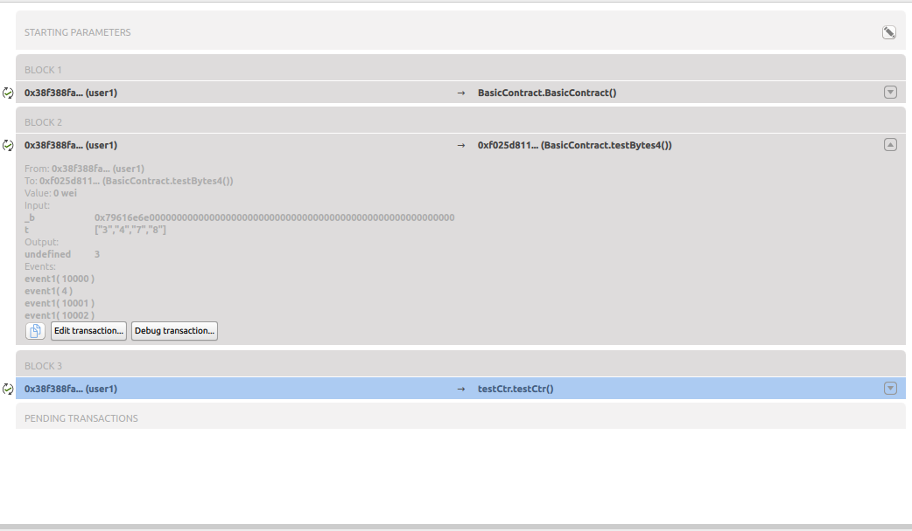

.. _sec:transaction-explorer:

Transaction Explorer
====================

Using the transaction pane

The transaction pane enables you to explore transactions receipts,
including

 * Input parameters

 * Return parameters

 * Event logs

To display the transaction explorer, click on the down triangle icon
which is on the right of each transaction, this will expand
transaction details:

|image0|

Then you can either copy the content of this transaction in the
clipboard, Edit the current transaction (you will have to rerun the
blockchain then), or debug the transaction.

