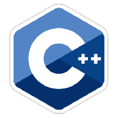

.. _cpp-ethereum:

################################################################################
cpp-ethereum
################################################################################

Quick Start
================================================================================

- The Github project for the Ethereum C++ client is `webthree-umbrella <http://github.com/ethereum/webthree-umbrella>`_.
- We will be moving that back to `cpp-ethereum-github`_ as part of our :ref:`project-reboot`.
- If you just want to install binaries then head to :ref:`Installing binaries`.
- If you want to build from source then head to :ref:`Building from source`.
- You can chat with the community and developers at `cpp-ethereum-gitter`_
- The developers have their in-depth conversations at `cpp-ethereum-development-gitter`_
- Please log any issues using the `Github issue tracker <http://github.com/ethereum/webthree-umbrella/issues>`_.
- cpp-ethereum is extremely portable and is used on a :ref:`very broad range of platforms <cpp-ethereum-portability>`.

.. _cpp-ethereum-github: https://github.com/ethereum/cpp-ethereum
.. _cpp-ethereum-gitter: https://gitter.im/ethereum/cpp-ethereum
.. _cpp-ethereum-development-gitter: https://gitter.im/ethereum/cpp-ethereum-development

Details
================================================================================

.. toctree::
   :maxdepth: 2

   project-reboot.rst
   history-of-the-code.rst
   portability.rst
   installing-binaries/index.rst
   building-from-source/index.rst
   running.rst
   what-are-the-modules.rst
   ./automation.rst
