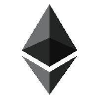
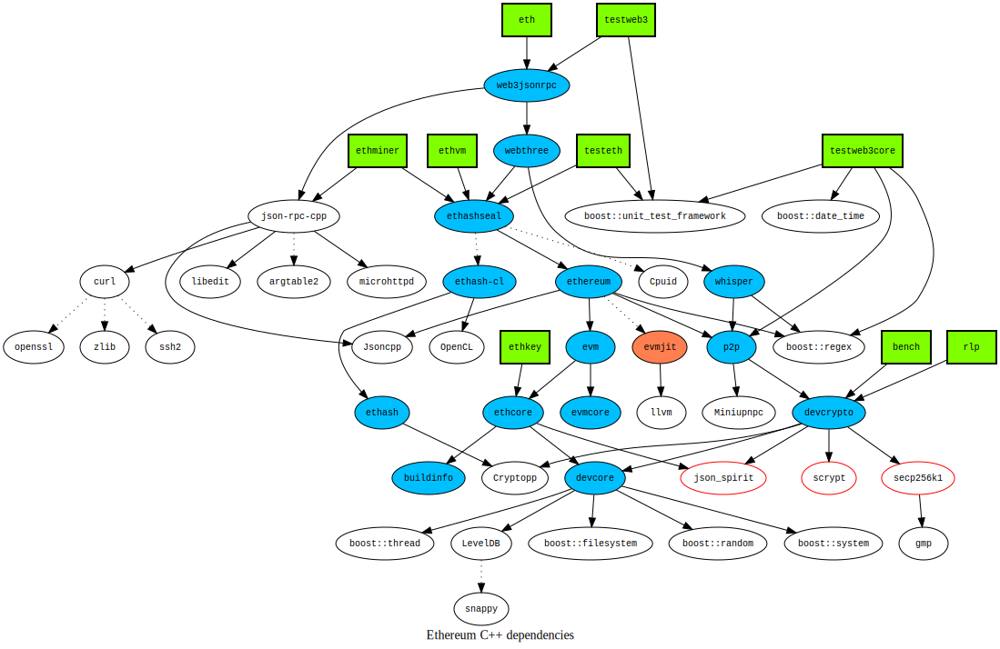
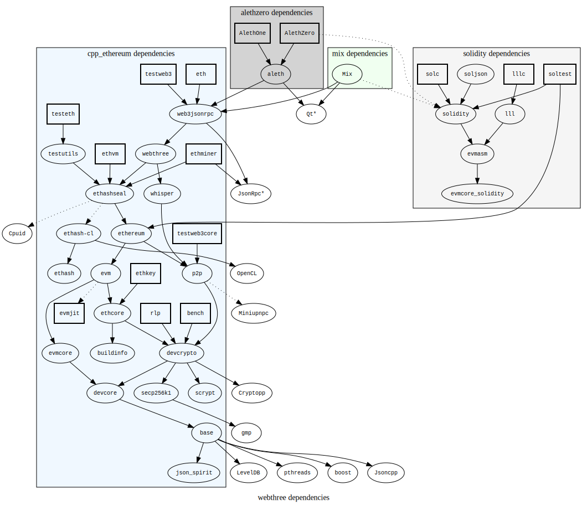

.. _cpp-ethereum:

################################################################################
cpp-ethereum
################################################################################

..  image:: ../../img/35k9.png
    :height: 187px
    :width: 187px

   
Quick Start
--------------------------------------------------------------------------------

- The Github project for the Ethereum C++ client is `webthree-umbrella <http://github.com/ethereum/webthree-umbrella>`_.
- Please log any issues using the `webthree-umbrella Github issue tracker <http://github.com/ethereum/webthree-umbrella/issues>`_.
- You can chat with the development team and community on the `cpp-ethereum gitter channel <https://gitter.im/ethereum/cpp-ethereum>`_.
- If you just want to install binaries then head to :ref:`Installing binaries`.
- If you want to build from source then head to :ref:`Building from source`.

History of the code
--------------------------------------------------------------------------------

The `C++ Ethereum project <http://github.com/ethereum/webthree-umbrella>`_ was
initiated by `Gavin Wood <http://gavwood.com/>`_, the
`former CTO <https://blog.ethereum.org/2016/01/11/last-blog-post/>`_ of the
Ethereum Foundation, in December 2013.   It is the second most popular of the
clients with around `8% of 'market share' <http://ethernodes.org/>`_, trailing
a long way behind go-ethereum.

Many of the original C++ developers moved on to roles at
`Slock.it <http://slock.it>`_ and `Ethcore <http://ethcore.io>`_ in
late 2015 and early 2016 following a
`75% cut in funding <https://blog.ethereum.org/2016/01/07/2394/>`_ for C++
development.  Those cuts were part of a broader effort to bring Foundation
costs under control, and they happened prior to the recent spike in ETH
value which has put the Foundation in a much more comfortable financial
position.

What are the primary executables?
--------------------------------------------------------------------------------

- **eth** A command-line Ethereum full-node that can be controlled via RPC.
- **mix** An IDE for contract and user interface development, testing and deployment to the blockchain.
- **solc**  The solidity command line compiler
- **lllc** The LLL command-line compiler.

Deprecated executables, to be retired soon
--------------------------------------------------------------------------------

- **AlethZero** A Qt-based all-encompassing GUI for interacting with Ethereum (receives minimal support).
- **AlethOne** One-click GUI miner.
- **EthKey** Key management CLI.

Project reboot
--------------------------------------------------------------------------------

The project is going through a `reboot under new leadership
<https://blog.ethereum.org/2016/02/12/ethereum-dev-update-c-roadmap/>`_.  At
the time of writing, we have a number of moving parts.  Please bear with us!

We have been `simplifying the naming
<https://github.com/ethereum/webthree-umbrella/issues/250>`_, but that is
a work-in-progress.  That will be followed up in our next milestone with
a `consolidation of git
repos <https://github.com/ethereum/webthree-umbrella/issues/251>`_.

Current reality (squares are applications, circles are libraries):

Target refactoring after Homestead:

What are the various modules?
--------------------------------------------------------------------------------

- **AlethZero** - A Qt-based GUI for interacting with Ethereum. Receives minimal support.
- **AlethOne** One-click GUI miner.
- **libethereum** - Modules related to the Ethereum part of web3, i.e. consensus engine, blockchain download, virtual machine.
    - **ethkey**: stand-alone key management
    - **ethminer**: stand-alone ethash miner
    - ethvm: stand-alone EVM execution utility
    - evmjit: library for the EVM just-in-time compiler
    - libethash: ethash mining POW algorithm implementation
    - libethash-cl: ethash mining code for GPU mining (OpenCL)
    - libethashseal: generic wrapper around the POW block seal engine. Also contains the genesis states for all ethash-based chains.
    - libethcore: collection of core data structures and concepts
    - libethereum: main consensus engine (minus EVM). Includes the State and BlockChain classes.
    - libevm: Ethereum Virtual Machine implementation (interpreter).
    - libevmasm: EVM assembly tools, also contains the optimizer.
    - libevmcore: elementary data structures of the EVM, opcodes, gas costs, ...
    - liblll: Low-level LISP-like Language compiler & assembler.
    - libnatspec: natspec script evaluator (confirmation messages)
    - libtestutils: utilities for testing code
    - lllc: LLL compiler commandline interface
- **libweb3core** - Web3 core libraries, networking, encoding, decoding, basic data structures.
    - bench: trie benchmarking
    - libdevcore: data structures, utilities, rlp, trie, memory db
    - libdevcrypto: crypto primitives. Depends on libsecp256k1 and libcrypto++.
    - libp2p: core peer to peer networking implementation (excluding specific sub-protocols)
    - rlp: stand-alone rlp en-/decoder
- **mix** - DApp IDE
- **solidity** - Solidity compiler
    - docs: documentation, appears at http://solidity.readthedocs.org/
    - libsolidity: actual implementation
    - analysis: reference resolution, type checking, ... (builds up the annotations for the AST)
    - ast: abstract syntax tree and type system
    - codegen: assembly code generation from annotated AST
    - formal: formal verification
    - interface: external interface for users of libsolidity
    - parsing: parser (creates the non-annotated AST)
    - solc: commandline compiler
- **web3.js** - JavaScript DApp framework library (connects to backend via RPC / IPC)
- **webthree** - actual client / node implementation ("eth")
    - eth: commandline client / node
    - libjsconsole: JavaScript console for access to eth - deprecated, to be replaced by nodejs application
    - libjsengine: underlying engine for libjsconsole, to be removed
    - libweb3jsonrpc: json-rpc server-side endpoint, provides http and IPC (unix socket, windows pipe) connectors
    - libwebthree: service connectors for ethereum, swarm/ipfs and whisper.
    - libwhisper: whisper implementation
- **webthree-helpers** - build system and some external dependencies
    - cmake: cmake files for build system, contains specification of inter-dependencies
    - utils: external dependencies
        - json_spirit: JSON parser written for Boost's Spirit library.
        - libscrypt: scrypt implementation
        - secp256k1: implementation of the SECP 256k1 ECDSA signing algorithm.

Installing and building
--------------------------------------------------------------------------------

.. toctree::
   :maxdepth: 2

   installing-binaries/index.rst
   building-from-source/index.rst
