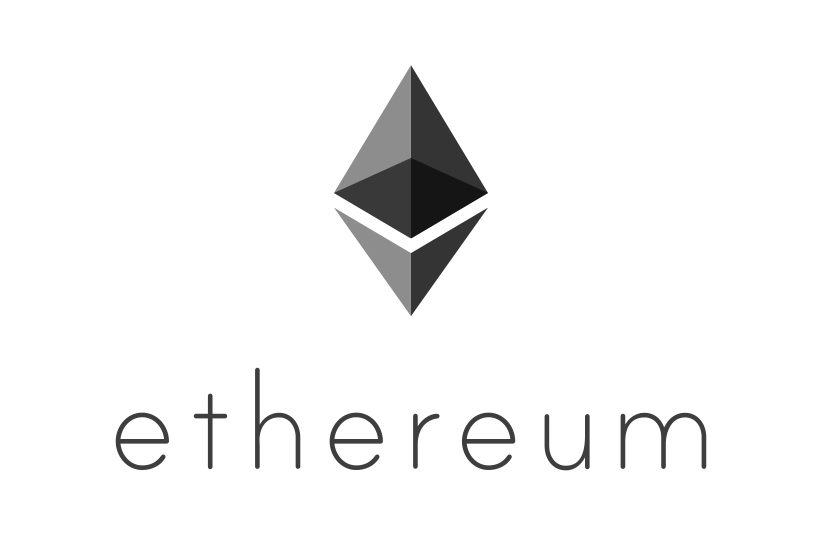

.. homestead guide documentation master file, created by
   sphinx-quickstart on Tue Jan  5 17:30:05 2016.
   You can adapt this file completely to your liking, but it should at least
   contain the root `toctree` directive.

Welcome to Ethereum Homestead Documentation!
============================================

..   :height: 300px
..   :width: 300 px
   :scale: 50 %
   :alt: ethereum-logo
   :align: center

Contents
========

.. toctree::
   :maxdepth: 2

   about.rst
   introduction/introduction.rst
   ethereum-ecosystem/ethereum-ecosystem.rst
   using-ethereum-the-basics/using-ethereum-the-basics.rst
   contracts-and-transactions/contracts-and-transactions.rst
   developing-on-ethereum/developing-on-ethereum.rst
   frequently-asked-questions/frequently-asked-questions.rst

Structure of Guide
==================

Introduction
  - What is Ethereum?
  - The Homestead Release
  - History of Ethereum[focus on brevity vs completeness with links to outside resources]
  - Disclaimer [security/legal warning, etc.]
  - Glossary [of Common Ethereum Terms]

Ethereum Ecosystem
  - Ethereum Network Stats
  - Client Implementations
  - EVM Compilers
  - Block Explorers
  - Miscellaneous Tools
  - Exchanges
  - Mining Pools
  - Base Layer Services
  - DApps
  - Community

    * Fora [github, wiki, gitter, reddit, forum, stackoverflow]
    * Hubs
    * Meetups

Using Ethereum: The Basics
  - Installing a Client

    * Linux
    * Windows
    * Mac
    * iOs
    * Android
    * Raspberry Pi
    * ARM
    * Binaries
    * Installing from Source

  - Connecting to the Network
    * How to Connect
    * Light Client Network Connectivity
    * NAT and Peer Discovery

  - Creating an Account

    * Using Console
    * Using EthKey
    * Using Mist
    * Using RPC

  - Account Management

    * What are keys, wallets, and accounts?
    * Keys
    * Wallets
    * Accounts (EOA) [Externally Owned Accounts are referenced here. make sure to differentiate from contract accounts that are mentioned later in the guide]

  - Backup Import Accounts\

    * Backing Up Wallets
    * Importing Wallets [including pre-sale wallets]
    * Online wallets, Paper Wallets, and Cold Storage

  - Ether

    * What is Ether?
    * Denominations
    * Getting Ether [Will point to mining and exchanges pages with explanation of both]
    * Sending Ether

  - Mining

    * CPU Mining
    * GPU Mining
    * Pool Mining [Will link to mining pools list in ecosystem section]

Contracts and Transactions
  - Account Types, Gas, and Transactions

    * EOA vs Contract Accounts
    * What is a Transaction? [in the context of Ethereum]
    * What is Gas? [explain that it is the fuel for Ethereum transactions]
    * Estimating Gas
    * Transaction Pool
    * Lifecycle of a Transaction
    * Signing Transactions Offline

  - Contracts

    * What is a Contract?
    * Write a Contract [Point to solidity docs, but give small example of contract]
    * Compile a Contract [use same example]
    * Create and Deploy a Contract
    * Interacting with a Contract
    * Console
    * web3.js
    * RPC

  - Accessing Contracts and Transactions

    * APIs
    * Console
    * RPC
    * Javascript
    * Viewing Contracts and Transactions

**Developing on Ethereum**

- Developer Tools

  * IDEs/Frameworks
  * Solidity Contract Language Resources
  * Other Tools

- DApp Development

  * Web3
  * Conntecting to Morden Testnet
  * Setting Up Private Testnet

- Web3 Base Layer Services

  * SWARM
  * Whisper
  * Name Registry
  * Contract Registry

**Frequently Asked Questions**
