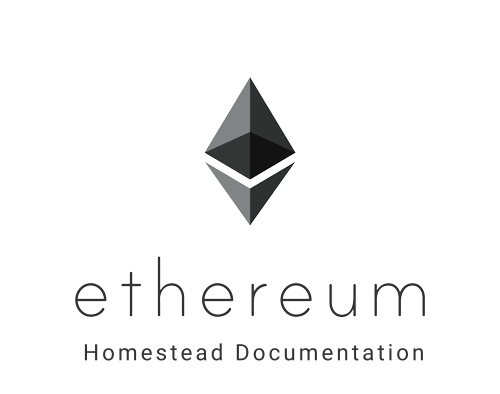

.. homestead guide documentation master file, created by
   sphinx-quickstart on Tue Jan  5 17:30:05 2016.
   You can adapt this file completely to your liking, but it should at least
   contain the root `toctree` directive.

Ethereum Homestead Documentation
===============================================================================

..   :height: 500px
..   :width: 394 px
   :scale: 50 %
   :alt: ethereum-logo
   :align: center

This documentation is the result of an ongoing collaborative effort by
volunteers from the Ethereum :ref:`community`.  Although it has not been
authorized by the :ref:`foundation`, we hope you will find it useful.
We welcome new :ref:`contributors`. Note that sections of this guide
may be outdated. The Guide may be considered to be a historic reference
since Ethereum had the Metropolis phase 1 fork, `Constantinople <https://eips.ethereum.org/EIPS/eip-609>`_.
An alternative documentation base may be used at https://github.com/ethereum/wiki/wiki
("the Wiki"), which is being actively maintained, and is also freely
editable by anyone with a GitHub account (while editing this repo requires
making a PR and being merged by a collaborator, or accepting an invitation
as a collaborator). Note that documentation in this guide that is still
relevant could be moved to the Wiki.

Contents
===============================================================================

.. toctree::
   :maxdepth: 4

   introduction/index.rst
   ethereum-clients/index.rst
   connecting-to-clients/index.rst
   account-management.rst
   ether.rst
   network/index.rst
   mining.rst
   contracts-and-transactions/index.rst
   frequently-asked-questions/frequently-asked-questions.rst
   glossary.rst
   about.rst

Improve the Documentation
===============================================================================

See `this page <https://ethereum-homestead.readthedocs.org/en/latest/about.html>`__ to help us improve the documentation.
