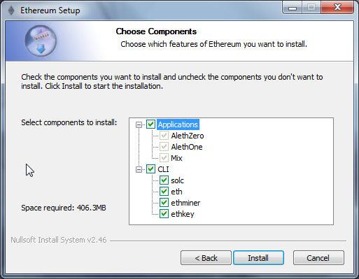

.. _mining:

********************************************************************************
Mining
********************************************************************************

Introduction
================================================================================

The word mining originates in the context of the gold analogy for crypto currencies. Gold or precious metals are scarce, so are digital tokens, and the only way to increase the total volume is through mining. This is appropriate to the extent that in Ethereum too, the only mode of issuance post launch is via mining. Unlike these examples however, mining is also the way to secure the network by creating, verifying, publishing and propagating blocks in the blockchain.

- Mining Ether = Securing the Network = Verifying Computation

What is mining?
--------------------------------------------------------------------------------

Ethereum, like all blockchain technologies, uses an incentive-driven model of security. Consensus is based on choosing the block with the highest total difficulty. Miners produce blocks which the others check for validity. Among other well-formedness criteria, a block is only valid if it contains *proof of work* (PoW) of a given *difficulty*. Note that in the Ethereum Serenity milestone, this is likely going to be replaced by a  (see :ref:`proof of stake model <POS vs POW>` ).

The Ethereum blockchain is in many ways similar to the Bitcoin blockchain, although it does have some differences. The main difference between Ethereum and Bitcoin with regard to the blockchain architecture is that, unlike Bitcoin, Ethereum blocks contain a copy of both the transaction list and the most recent state (the root hash of the merkle patricia trie encoding the state to be more precise). Aside from that, two other values, the block number and the difficulty, are also stored in the block.

The proof of work algorithm used is called `Ethash <https://github.com/ethereum/wiki/wiki/Ethash>`_ (a modified version of `the Dagger-Hashimoto algorithm <https://github.com/ethereum/wiki/wiki/Dagger-Hashimoto>`_) and involves finding a *nonce* input to the algorithm so that the result is below a certain difficulty threshold. The point in PoW algorithms is that there is no better strategy to find such a nonce than enumerating the possibilities, while verification of a solution is trivial and cheap. Since outputs have a uniform distribution (as they are the result of the application of a hash function), we can guarantee that, on average, the time needed to find such a nonce depends on the difficulty threshold. This makes it possible to control the time of finding a new block just by manipulating the difficulty.

As dictated by the protocol, the difficulty dynamically adjusts in such a way that on average one block is produced by the entire network every 15 seconds. We say that the network produces a blockchain with a *15 second block time*.
This "heartbeat" basically punctuates the synchronisation of system state
and guarantees that maintaining a fork (to allow double spend) or
rewriting history by malicious actors are impossible unless the attacker possesses more than half of the network mining power (this is the so called *51% attack*).

Any node participating in the network can be a miner and their expected revenue from mining will be directly proportional to their (relative) mining power or *hashrate*, i.e., the number of nonces tried per second normalised by the total hashrate of the network.

Ethash PoW is *memory hard*, making it *ASIC resistant*. Memory hardness is achieved with a proof of work algorithm that requires choosing subsets of a fixed resource dependent on the nonce and block header. This resource (a few gigabyte size data) is called a **DAG**. The `DAG <https://github.com/ethereum/wiki/wiki/Ethash-DAG>`_ is totally different every 30000 blocks, a 125-hour window called *epoch* (roughly 5.2 days) and takes a while to generate. Since the DAG only depends on block height, it can be pregenerated but if its not, the client needs to wait until the end of this process to produce a block. If clients do not pregenerate and cache DAGs ahead of time the network may experience massive block delay on each epoch transition. Note that the DAG does not need to be generated for verifying the PoW essentially allowing for verification with both low CPU and small memory.

As a special case, when you start up your node from scratch, mining will only start once the DAG is built for the current epoch.

Mining rewards
--------------------------------------------------------------------------------

The successful PoW miner of the winning block receives:

* a *static block reward* for the 'winning' block, consisting of exactly 5.0 Ether
* cost of the gas expended within the block – an amount of ether that depends on the current gas price
* an extra reward for including uncles as part of the block, in the form of an extra 1/32 per uncle included

All the gas consumed by the execution of all the transactions in the block submitted by the winning miner is paid by the senders of each transaction. The gas cost incurred is credited to the miner's account as part of the consensus protocol. Over time, it is expected these will dwarf the static block reward.

*Uncles* are stale blocks i.e. with parents that are ancestors (max 6 blocks back) of the including block. Valid uncles are rewarded in order to neutralise the effect of network lag on the dispersion of mining rewards, thereby increasing security (this is called the GHOST protocol). Uncles included in a block formed by the successful PoW miner receive 7/8 of the static block reward (=4.375 ether). A maximum of 2 uncles are allowed per block.

    * `Uncles ELI5 on reddit <https://www.reddit.com/r/ethereum/comments/3c9jbf/wtf_are_uncles_and_why_do_they_matter/>`_
    * `Forum thread explaining uncles <https://forum.ethereum.org/discussion/2262/eli5-whats-an-uncle-in-ethereum-mining>`_

Mining success depends on the set block difficulty. Block difficulty dynamically adjusts each block in order to regulate the network hashing power to produce a 12 second blocktime. Your chances of finding a block therefore follows from your hashrate relative to difficulty.

Ethash DAG
--------------------------------------------------------------------------------

Ethash uses a *DAG* (directed acyclic graph) for the proof of work algorithm, this is generated for each *epoch*, i.e., every 30000 blocks (125 hours, ca. 5.2 days). The DAG takes a long time to generate. If clients only generate it on demand, you may see a long wait at each epoch transition before the first block of the new epoch is found. However, the DAG only depends on the block number, so it can and should be calculated in advance to avoid long wait times at each epoch transition. Both ``geth`` and ``ethminer`` implement automatic DAG generation and maintains two DAGs at a time for smooth epoch transitions. Automatic DAG generation is turned on and off when mining is controlled from the console. It is also turned on by default if ``geth`` is launched with the ``--mine`` option. Note that clients share a DAG resource, so if you are running multiple instances of any client, make sure automatic dag generation is switched off in all but one instance.

To generate the DAG for an arbitrary epoch:

.. code-block:: bash

    geth makedag <block number> <outputdir>

For instance ``geth makedag 360000 ~/.ethash``. Note that ethash uses
``~/.ethash`` (Mac/Linux) or ``~/AppData/Ethash`` (Windows) for the DAG
so that it can shared between different client implementations as well as multiple running instances.

The algorithm
================================================================================

Our algorithm, `Ethash <https://github.com/ethereum/wiki/wiki/Ethash>`__ (previously known as Dagger-Hashimoto), is based around the provision of a large, transient, randomly generated dataset which forms a DAG (the Dagger-part), and attempting to solve a particular constraint on it, partly determined through a block's header-hash.

It is designed to hash a fast verifiability time within a slow CPU-only environment, yet provide vast speed-ups for mining when provided with a large amount of memory with high-bandwidth. The large memory requirements mean that large-scale miners get comparatively little super-linear benefit. The high bandwidth requirement means that a speed-up from piling on many super-fast processing units sharing the same memory gives little benefit over a single unit. This is important in that pool mining have no benefit for nodes doing verification, thus discourageing centralisation.

Communication between the external mining application and the Ethereum daemon for work provision and submission happens through the JSON-RPC API. Two RPC functions are provided; ``eth_getWork`` and ``eth_submitWork``.

These are formally documented on the `JSON-RPC API <https://github.com/ethereum/wiki/wiki/JSON-RPC>`_ wiki article under `miner <https://github.com/ethereum/go-ethereum/wiki/JavaScript-Console#miner>`_.

In order to mine you need a fully synced Ethereum client that is enabled for mining and at least one ethereum account. This account is used to send the mining rewards to and is often referred to as *coinbase* or *etherbase*. Visit the ":ref:`creating_an_account`" section of this guide to learn how to create an account.

.. warning:: Ensure your blockchain is fully synchronised with the main chain before starting to mine, otherwise you will not be mining on the main chain.

CPU mining
================================================================================

You can use your computer's central processing unit (CPU) to mine ether. This is no longer profitable, since GPU miners are roughly two orders of magnitude more efficient. However, you can use CPU mining to mine on the Morden testnet or a private chain for the purposes of creating the ether you need to test contracts and transactions without spending your real ether on the live network.

.. note:: The testnet ether has no value other than using it for testing purposes (see :ref:`test-networks`).

Using geth
-------------------------------
When you start up your ethereum node with ``geth`` it is not mining by
default. To start it in CPU mining mode, you use the ``--mine`` `command line option <https://github.com/ethereum/go-ethereum/wiki/Command-Line-Options>`__.
The ``-minerthreads`` parameter can be used to set the number parallel mining threads (defaulting to the total number of processor cores).

``geth --mine --minerthreads=4``

You can also start and stop CPU mining at runtime using the `console <https://github.com/ethereum/go-ethereum/wiki/JavaScript-Console#adminminerstart>`__. ``miner.start`` takes an optional parameter for the number of miner threads.

.. code-block:: Javascript

    > miner.start(8)
    true
    > miner.stop()
    true

Note that mining for real ether only makes sense if you are in sync with the network (since you mine on top of the consensus block). Therefore the eth blockchain downloader/synchroniser will delay mining until syncing is complete, and after that mining automatically starts unless you cancel your intention with ``miner.stop()``.

In order to earn ether you must have your **etherbase** (or **coinbase**) address set. This etherbase defaults to your primary account. If you don't have an etherbase address, then ``geth --mine`` will not start up.

You can set your etherbase on the command line:

.. code-block:: bash

    geth --etherbase 1 --mine  2>> geth.log // 1 is index: second account by creation order OR
    geth --etherbase '0xa4d8e9cae4d04b093aac82e6cd355b6b963fb7ff' --mine 2>> geth.log

You can reset your etherbase on the console too:

.. code-block:: javascript

    miner.setEtherbase(eth.accounts[2])

Note that your etherbase does not need to be an address of a local account, just an existing one.

There is an option `to add extra Data <https://github.com/ethereum/go-ethereum/wiki/JavaScript-Console#minersetextra>`__ (32 bytes only) to your mined blocks. By convention this is interpreted as a unicode string, so you can set your short vanity tag.

.. code-block:: javascript

    miner.setExtra("ΞTHΞЯSPHΞЯΞ")
    ...
    debug.printBlock(131805)
    BLOCK(be465b020fdbedc4063756f0912b5a89bbb4735bd1d1df84363e05ade0195cb1): Size: 531.00 B TD: 643485290485 {
    NoNonce: ee48752c3a0bfe3d85339451a5f3f411c21c8170353e450985e1faab0a9ac4cc
    Header:
    [
    ...
            Coinbase:           a4d8e9cae4d04b093aac82e6cd355b6b963fb7ff
            Number:             131805
            Extra:              ΞTHΞЯSPHΞЯΞ
    ...
    }

You can check your hashrate with `miner.hashrate <https://github.com/ethereum/go-ethereum/wiki/JavaScript-Console#adminminerhashrate>`_, the result is in H/s (Hash operations per second).

.. code-block:: javascript

    > miner.hashrate
    712000

After you successfully mined some blocks, you can check the ether balance of your etherbase account. Now assuming your etherbase is a local account:

.. code-block:: javascript

    > eth.getBalance(eth.coinbase).toNumber();
    '34698870000000'

In order to spend your earnings on gas to transact, you will need to have this account unlocked.

.. code-block:: javascript

    > personal.unlockAccount(eth.coinbase)
    Password
    true

You can check which blocks are mined by a particular miner (address) with the following code snippet on the console:

.. code-block:: javascript

    function minedBlocks(lastn, addr) {
      addrs = [];
      if (!addr) {
        addr = eth.coinbase
      }
      limit = eth.blockNumber - lastn
      for (i = eth.blockNumber; i >= limit; i--) {
        if (eth.getBlock(i).miner == addr) {
          addrs.push(i)
        }
      }
      return addrs
    }
    // scans the last 1000 blocks and returns the blocknumbers of blocks mined by your coinbase
    // (more precisely blocks the mining reward for which is sent to your coinbase).
    minedBlocks(1000, eth.coinbase);
    //[352708, 352655, 352559]

Note that it will happen often that you find a block yet it never makes it to the canonical chain. This means when you locally include your mined block, the current state will show the mining reward credited to your account, however, after a while, the better chain is discovered and we switch to a chain in which your block is not included and therefore no mining reward is credited. Therefore it is quite possible that as a miner monitoring their coinbase balance will find that it may fluctuate quite a bit.

GPU mining
================================================================================

Hardware
-------------------------------

The algorithm is memory hard and in order to fit the DAG into memory, it needs 1-2GB of RAM on each GPU. If you get ``Error GPU mining. GPU memory fragmentation?`` you do not have enough memory.
The GPU miner is implemented in OpenCL, so AMD GPUs will be 'faster' than same-category NVIDIA GPUs.
ASICs and FPGAs are relatively inefficient and therefore discouraged.
To get openCL for your chipset and platform, try:

- `AMD SDK openCL <http://developer.amd.com/tools-and-sdks/opencl-zone/amd-accelerated-parallel-processing-app-sdk>`_
- `NVIDIA CUDA openCL <https://developer.nvidia.com/cuda-downloads>`_

Ubuntu Linux set-up
-------------------------

For this quick guide, you'll need Ubuntu 14.04 or 15.04 and the fglrx graphics drivers. You can use NVidia drivers and other platforms, too, but you'll have to find your own way to getting a working OpenCL install with them, such as `Genoil's ethminer fork <http://cryptomining-blog.com/tag/ethminer/>`_.

If you're on 15.04, Go to "Software and Updates > Additional Drivers" and set it to "Using video drivers for the AMD graphics accelerator from fglrx".

If you're on 14.04, go to "Software and Updates > Additional Drivers" and set it to "Using video drivers for the AMD graphics accelerator from fglrx". Unfortunately, for some of you this will not work due to a known bug in Ubuntu 14.04.02 preventing you from switching to the proprietary graphics drivers required to GPU mine.

So, if you encounter this bug, and before you do anything else, go to "Software and updates > Updates" and select "Pre-released updates trusty proposed". Then, go back to "Software and Updates > Additional Drivers" and set it to "Using video drivers for the AMD graphics accelerator from fglrx"). After rebooting, it's well worth having a check that the drivers have now indeed been installed correctly (For example by going to "Additional Drivers" again).

Whatever you do, if you are on 14.04.02 do not alter the drivers or the drivers configuration once set. For example, the usage of aticonfig --initial (especially with the -f, --force option) can 'break' your setup. If you accidentally alter their configuration, you'll need to de-install the drivers, reboot, reinstall the drivers and reboot.

Mac set-up
-------------------------------

.. code-block:: bash

 wget http://developer.download.nvidia.com/compute/cuda/7_0/Prod/local_installers/cuda_7.0.29_mac.pkg
 sudo installer -pkg ~/Desktop/cuda_7.0.29_mac.pkg -target /
 brew update
 brew tap ethereum/ethereum
 brew reinstall cpp-ethereum --with-gpu-mining --devel --headless --build-from-source

You check your cooling status:

.. code-block:: bash

  aticonfig --adapter=0 --od-gettemperature

Windows set-up
-------------------------------
`Download the latest Eth\+\+ installation <https://github.com/ethereum/webthree-umbrella/releases>`_ and choose ethminer at the "Choose Components" screen of the installation screen.

..   :height: 513px
..   :width: 399 px
   :alt: ethereum-ethminer-set-upfdg

Using ethminer with geth
-------------------------------

.. code-block:: bash

    geth account new // Set-up ethereum account if you do not have one
    geth --rpc --rpccorsdomain localhost 2>> geth.log &
    ethminer -G  // -G for GPU, -M for benchmark
    tail -f geth.log

``ethminer`` communicates with geth on port 8545 (the default RPC port in geth). You can change this by giving the ``--rpcport`` option to ``geth``. Ethminer will find geth on any port. Note that you need to set the CORS header with ``--rpccorsdomain localhost``. You can also set port on ``ethminer`` with ``-F http://127.0.0.1:3301``. Setting the ports is necessary if you want several instances mining on the same computer, although this is somewhat pointless. If you are testing on a private chain, we recommend you use CPU mining instead.

.. note:: You do **not** need to give ``geth`` the ``--mine`` option or start the miner in the console unless you want to do CPU mining on TOP of GPU mining.

If the default for ``ethminer`` does not work try to specify the OpenCL device with: ``--opencl-device X`` where X is {0, 1, 2,...}. When running ``ethminer`` with ``-M`` (benchmark), you should see something like:

.. code-block:: bash

    Benchmarking on platform: { "platform": "NVIDIA CUDA", "device": "GeForce GTX 750 Ti", "version": "OpenCL 1.1 CUDA" }

    Benchmarking on platform: { "platform": "Apple", "device": "Intel(R) Xeon(R) CPU E5-1620 v2 @ 3.70GHz", "version": "OpenCL 1.2 " }

To debug ``geth``:

.. code-block:: bash

    geth  --rpccorsdomain "localhost" --verbosity 6 2>> geth.log

To debug the miner:

.. code-block:: bash

    make -DCMAKE_BUILD_TYPE=Debug -DETHASHCL=1 -DGUI=0
    gdb --args ethminer -G -M

..  note:: hashrate info is not available in ``geth`` when GPU mining.

Check your hashrate with ``ethminer``, ``miner.hashrate`` will always report 0.

Using ethminer with eth
-------------------------------

Mining on a single GPU
^^^^^^^^^^^^^^^^^^^^^^^^^^^^^^^
In order to mine on a single GPU all that needs to be done is to run eth with the following arguments:

.. code-block:: bash

 eth -v 1 -a 0xcadb3223d4eebcaa7b40ec5722967ced01cfc8f2 --client-name "OPTIONALNAMEHERE" -x 50 -m on -G

- ``-v 1`` Set verbosity to 1. Let's not get spammed by messages.
- ``-a YOURWALLETADDRESS`` Set the coinbase, where the mining rewards will go to. The above address is just an example. This argument is really important, make sure to not make a mistake in your wallet address or you will receive no ether payout.
- ``--client-name "OPTIONAL"`` Set an optional client name to identify you on the network
- ``-x 50`` Request a high amount of peers. Helps with finding peers in the beginning.
- ``-m on`` Actually launch with mining on.
- ``-G`` set GPU mining on.

While the client is running you can interact with it using either
geth attach` or [ethconsole](https://github.com/ethereum/ethereum-console).

Mining on a multiple GPUs
^^^^^^^^^^^^^^^^^^^^^^^^^^^^^^^
Mining with multiple GPUs and eth is very similar to mining with geth and multiple GPUs.
Ensure that an eth node is running with your coinbase address properly set:

.. code-block:: bash

   eth -v 1 -a 0xcadb3223d4eebcaa7b40ec5722967ced01cfc8f2 --client-name "OPTIONALNAMEHERE" -x 50 -j

Notice that we also added the -j argument so that the client can have the JSON-RPC server enabled to communicate with the ethminer instances. Additionally we removed the mining related arguments since ethminer will now do the mining for us.
For each of your GPUs execute a different ethminer instance:

.. code-block:: bash

   ethminer --no-precompute -G --opencl-device X

Where X is the index number corresponding to the openCL device you want the ethminer to use  {0, 1, 2,...}.
In order to easily get a list of OpenCL devices you can execute ``ethminer --list-devices`` which will provide a list of all devices OpenCL can detect, with also some additional information per device.

Below is a sample output:

.. code-block:: console

 [0] GeForce GTX 770
     CL_DEVICE_TYPE: GPU
     CL_DEVICE_GLOBAL_MEM_SIZE: 4286345216
     CL_DEVICE_MAX_MEM_ALLOC_SIZE: 1071586304
     CL_DEVICE_MAX_WORK_GROUP_SIZE: 1024

Finally the ``--no-precompute`` argument requests that the ethminers don't create the DAG of the next epoch ahead of time. Although this is not recommended since you'll have a mining interruption every time when there's an epoch transition.

Benchmarking
^^^^^^^^^^^^^^^^^^^^^^^^^^^^^^^
Mining power tends to scale with memory bandwidth. Our implementation is written in OpenCL, which is typically supported better by AMD GPUs over NVidia. Empirical evidence confirms that AMD GPUs offer a better mining performance in terms of price than their NVidia counterparts.

To benchmark a single-device setup you can use ethminer in benchmarking mode through the -M option:

.. code-block:: bash

   ethminer -G -M

If you have many devices and you'll like to benchmark each individually, you can use the --opencl-device option similarly to the previous section:

.. code-block:: bash

 ethminer -G -M --opencl-device X

Use ethminer ``--list-devices`` to list possible numbers to substitute for the X {0, 1, 2,...}.

To start mining on Windows, first `download the geth windows binary <https://build.ethereum.org/builds/Windows%20Go%20master%20branch/>`_.

* Unzip Geth (right-click and select unpack) and launch Command Prompt. Use `cd` to navigate to the location of the Geth data folder. (e.g. ``cd /`` to go to the ``C:`` drive)
* Start geth by typing ``geth --rpc``.

As soon as you enter this, the Ethereum blockchain will start downloading. Sometimes your firewall may block the synchronisation process (it will prompt you when doing so). If this is the case, click "Allow access".

* First `download and install ethminer <http://cryptomining-blog.com/tag/ethminer-cuda-download/>`_, the C++ mining software (your firewall or Windows itself may act up, allow access)
* Open up another Command Prompt (leave the first one running!), change directory by typing ``cd /Program\ Files/Ethereum(++)/release``
* Now make sure `geth` has finished syncing the blockchain. If it is not syncing any longer, you can start the mining process by typing ``ethminer -G`` at the command prompt

At this point some problems may appear. If you get an error, you can abort the miner by pressing ``Ctrl+C``. If the error says
"Insufficient Memory", your GPU does not have enough memory to mine ether.

Pool mining
================================================================================

Mining pools are cooperatives that aim to smooth out expected revenue by pooling the mining power of participating miners. In return, they usually charge you 0-5% of your mining rewards. The mining pool submits blocks with proof of work from a central account and redistributes the reward to participants in proportion to their contributed mining power.

.. warning::  Most mining pools involve third party, central components which means they are not trustless. In other words, pool operators can run away with your earnings. Act with caution. There are a number of trustless, decentralised pools with open source codebase.

.. warning:: Mining pools only outsource proof of work calculation, they do not validate blocks or run the VM to check state transitions brought about by executing the transactions. This effectively make pools behave like single nodes in terms of security, so their growth poses a centralisation risk of a `51% attack <https://learncryptography.com/cryptocurrency/51-attack>`_. Make sure you follow the network capacity distribution and do not allow pools to grow too large.

Mining pools
--------------------------------------------------------------------

* `coinotron`_
* `nanopool`_
* `ethpool`_ - Predictable solo mining, unconventional payout scheme, affiliated with `etherchain\.org`_.
* `supernova`_
* `coinmine.pl`_
* `eth.pp.ua`_
* `talkether`_ - Unconventional payout scheme, partially decentralized
* `weipool`_
* `ethereumpool`_
* `pooleum`_
* `alphapool`_
* `cryptopool`_
* `unitedminers`_
* `dwarfpool`_ - Try to avoid this (currently over 50% of the network)
* `laintimes <http://pool.laintimes.com/>`_ - Discontinued

.. _Ethpool: https://github.com/etherchain-org/ethpool-core
.. _Ethpool source: https://github.com/etherchain-org/ethpool-core
.. _ethereumpool: https://ethereumpool.co/
.. _nanopool: http://eth.nanopool.org/
.. _pooleum: http://www.pooleum.com
.. _alphapool: http://www.alphapool.xyz/
.. _dwarfpool: http://dwarfpool.com/eth
.. _talkether: http://talkether.org/
.. _weipool: http://weipool.org/
.. _supernova: https://eth.suprnova.cc/
.. _coinmine.pl: https://www2.coinmine.pl/eth/
.. _eth.pp.ua:  https://eth.pp.ua/
.. _coinotron: https://www.coinotron.com/
.. _etherchain.org: https://etherchain.org/
.. _unitedminers: http://eth.unitedminers.cloud/
.. _cryptopool: http://ethereum.cryptopool.online/

Mining resources
=======================================================

* `Top miners of last 24h on etherchain <https://etherchain.org/statistics/miners>`_
* `pool hashrate distribution for august 2015 <ehttp://cryptomining-blog.com/5607-the-current-state-of-ethereum-mining-pools/>`_
* `Unmaintained list of pools on Forum <https://forum.ethereum.org/discussion/3659/list-of-pools>`_
* `Mining profitability calculator on cryptocompare <https://www.cryptocompare.com/mining/calculator/eth>`_
* `Mining profitability calculator on cryptowizzard <http://cryptowizzard.github.io/eth-mining-calculator/>`_
* `Mining profitability calculator on etherscan <http://etherscan.io/ether-mining-calculator/>`_
* `Mining profitability calculator on In The Ether <http://ethereum-mining-calculator.com/>`_
* `Mining difficulty chart on etherscan <http://etherscan.io/charts/difficulty>`_

.. _POS vs POW:

POS vs POW
-----------------------------

* https://www.reddit.com/r/ethereum/comments/38db1z/eli5_the_difference_between_pos_and_pow/
* https://blog.ethereum.org/2014/11/25/proof-stake-learned-love-weak-subjectivity/
* https://www.reddit.com/r/ethereum/comments/42o8oy/can_someone_explain_the_switch_to_pos_how_and_when/
